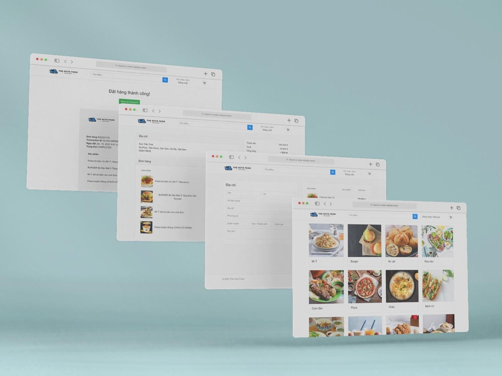

# TheOctoFood - Website đặt đồ ăn sử dụng Django
[English](README.md) | Tiếng Việt

## Hướng dẫn triển khai

Clone project về máy
```
git clone https://github.com/sownt/TheOctoFood.git && cd TheOctoFood
```
Bạn có thể triển khai project này bằng docker-compose (khuyến khích) hoặc triển khai trực tiếp bằng python

### 1. Triển khai với Docker compose (Khuyến khích)

#### Yêu cầu hệ thống:
- Docker engine
- docker-compose

Bạn có thể cài đặt [Docker Desktop](https://docs.docker.com/desktop/) cho Windows/macOS hoặc cài đặt [Engine](https://docs.docker.com/engine/) và [compose](https://docs.docker.com/compose/install/) cho Linux.

Trước tiên bạn cần tạo file `.env` trong thư mục /src/TheOctoFood/ để cài biến môi trường cho project.
```
SECRET_KEY=                                     # Django secret key
DATABASE_ENGINE=django.db.backends.mysql
DATABASE_NAME=theoctofood
DATABASE_USER=                                  # MariaDB/MySQL username
DATABASE_PASSWORD=                              # MariaDB/MySQL password
DATABASE_HOST=                                  # MariaDB/MySQL host
DATABASE_PORT=3306
LANGUAGE_CODE=en-us
TIME_ZONE=Asia/Ho_Chi_Minh
EMAIL_HOST=                                     # SMTP host
EMAIL_HOST_USER=                                # SMTP username
EMAIL_HOST_PASSWORD=                            # SMTP password
EMAIL_PORT=                                     # SMTP port
```
Sau đó chạy lệnh dưới để Docker thực hiện các công việc còn lại
```
docker-compose up
```

### 2. Triển khai trực tiếp bằng Python

#### Yêu cầu hệ thống:
- MySQL/MariaDB với cơ sở dữ liệu theoctofood được tạo sẵn

Bạn có thể tạo nó bằng lệnh
```
CREATE DATABASE IF NOT EXISTS `theoctofood` DEFAULT CHARACTER SET utf8mb4 COLLATE utf8mb4_general_ci;
```

Tạo môi trường ảo cho project
```
python -m venv .
```
Kích hoạt môi trường
```
Scripts\activate.bat    # Windows
source bin/activate     # Linux
```
Cài đặt các packages của project
```
pip install -r requirements.txt
```
Tạo file `.env` trong thư mục /src/TheOctoFood/ để cài biến môi trường cho project.
```
SECRET_KEY=                                     # Django secret key
DATABASE_ENGINE=django.db.backends.mysql
DATABASE_NAME=theoctofood
DATABASE_USER=                                  # MariaDB/MySQL username
DATABASE_PASSWORD=                              # MariaDB/MySQL password
DATABASE_HOST=                                  # MariaDB/MySQL host
DATABASE_PORT=3306
LANGUAGE_CODE=en-us
TIME_ZONE=Asia/Ho_Chi_Minh
EMAIL_HOST=                                     # SMTP host
EMAIL_HOST_USER=                                # SMTP username
EMAIL_HOST_PASSWORD=                            # SMTP password
EMAIL_PORT=                                     # SMTP port
```
Bạn có thể nhập dữ liệu mẫu từ file `/src/TheOctoFood/theoctofood.sql` vào database nễu muốn.

Cuối cùng là tích hợp và chạy project bằng lệnh dưới đây
```
python manage.py migrate && python manage.py runserver 0.0.0.0:8000
```